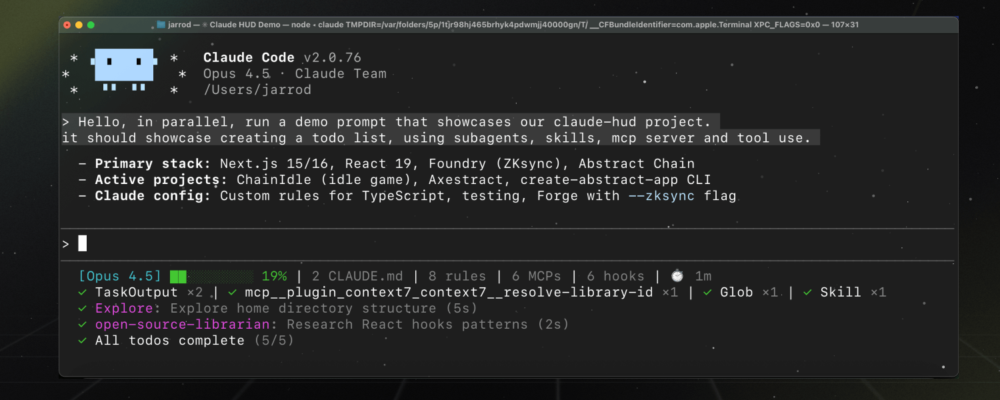

# Claude HUD

Claude Code 状态栏插件 — 实时显示上下文用量、工具活动、子代理状态和待办进度，始终显示在输入框下方。

[](LICENSE)
[](https://github.com/yang66yang/claude-hud/stargazers)



---

## 安装步骤

### 前置要求

- Claude Code v1.0.80+
- Node.js 18+ 或 Bun

### 第一步：安装插件

在 Claude Code 中运行：

```
/plugin install claude-hud
```

> **Linux 用户注意**：如果安装时报 `EXDEV: cross-device link not permitted` 错误，先执行：
> ```bash
> mkdir -p ~/.cache/tmp && TMPDIR=~/.cache/tmp claude
> ```
> 然后在新启动的会话中重新运行安装命令。

### 第二步：配置状态栏

```
/claude-hud:setup
```

安装完成！HUD 会立即显示，无需重启。

---

## Claude HUD 是什么？

Claude HUD 让你实时掌握 Claude Code 会话的运行状态：

| 显示内容 | 作用 |
|---------|------|
| **项目路径** | 知道当前在哪个项目中（支持 1-3 级目录深度） |
| **上下文健康度** | 在上下文窗口满之前精确了解使用情况 |
| **工具活动** | 实时查看 Claude 正在读取、编辑、搜索哪些文件 |
| **子代理追踪** | 查看正在运行的子代理及其工作内容 |
| **待办进度** | 实时追踪任务完成情况 |

## 显示效果

### 默认显示（2 行）

```
[Opus | Max] │ my-project git:(main*)
Context █████░░░░░ 45% │ Usage ██░░░░░░░░ 25% (1h 30m / 5h)
```
- **第 1 行** — 模型名称、订阅计划（或 `Bedrock`）、项目路径、git 分支
- **第 2 行** — 上下文进度条（绿 → 黄 → 红）和用量限制

### 可选行（通过 `/claude-hud:configure` 开启）

```
◐ Edit: auth.ts | ✓ Read ×3 | ✓ Grep ×2        ← 工具活动
◐ explore [haiku]: Finding auth code (2m 15s)    ← 子代理状态
▸ Fix authentication bug (2/5)                   ← 待办进度
```

---

## 工作原理

Claude HUD 使用 Claude Code 原生的 **statusline API** — 无需额外窗口，无需 tmux，适用于任何终端。

```
Claude Code → stdin JSON → claude-hud → stdout → 终端显示
           ↘ transcript JSONL（工具、代理、待办）
```

**核心特性：**
- 使用 Claude Code 原生 token 数据（非估算）
- 自动适配 Claude Code 报告的上下文窗口大小，包括 1M 上下文的新会话
- 解析 transcript 获取工具/代理活动信息
- 约每 300ms 更新一次

---

## 配置

随时自定义你的 HUD：

```
/claude-hud:configure
```

引导流程会处理布局和显示开关。高级设置（自定义颜色、阈值等）需要直接编辑配置文件：

- **首次设置**：选择预设（完整/精简/最小），然后微调各个元素
- **随时自定义**：开关各项显示、调整 git 显示样式、切换布局
- **保存前预览**：在保存之前查看 HUD 的实际效果

### 预设方案

| 预设 | 显示内容 |
|------|---------|
| **完整** | 全部开启 — 工具、代理、待办、git、用量、时长 |
| **精简** | 活动行 + git 状态，信息精简 |
| **最小** | 仅核心 — 模型名称和上下文进度条 |

选择预设后，可以单独开关各项元素。

### 手动配置

直接编辑 `~/.claude/plugins/claude-hud/config.json` 进行高级设置，如 `colors.*`、`pathLevels`、阈值覆盖等。运行 `/claude-hud:configure` 会保留这些手动设置。

### 配置项

| 配置项 | 类型 | 默认值 | 说明 |
|--------|------|--------|------|
| `lineLayout` | string | `expanded` | 布局模式：`expanded`（多行）或 `compact`（单行） |
| `pathLevels` | 1-3 | 1 | 项目路径显示的目录层级 |
| `elementOrder` | string[] | `["project","context","usage","environment","tools","agents","todos"]` | 多行模式下元素排列顺序，省略则隐藏 |
| `gitStatus.enabled` | boolean | true | 显示 git 分支 |
| `gitStatus.showDirty` | boolean | true | 未提交更改时显示 `*` |
| `gitStatus.showAheadBehind` | boolean | false | 显示领先/落后远程 `↑N ↓N` |
| `gitStatus.showFileStats` | boolean | false | 显示文件变更统计 `!M +A ✘D ?U` |
| `display.showModel` | boolean | true | 显示模型名称 `[Opus]` |
| `display.showContextBar` | boolean | true | 显示上下文进度条 `████░░░░░░` |
| `display.contextValue` | `percent` \| `tokens` \| `remaining` | `percent` | 上下文显示格式（`45%`、`45k/200k` 或 `55%` remaining） |
| `display.showConfigCounts` | boolean | false | 显示 CLAUDE.md、规则、MCP、Hook 数量 |
| `display.showDuration` | boolean | false | 显示会话时长 `⏱️ 5m` |
| `display.showSpeed` | boolean | false | 显示输出 token 速度 `out: 42.1 tok/s` |
| `display.showUsage` | boolean | true | 显示用量限制（仅 Pro/Max/Team） |
| `display.usageBarEnabled` | boolean | true | 用进度条而非文字显示用量 |
| `display.sevenDayThreshold` | 0-100 | 80 | 7 天用量达到此阈值时显示（0 = 始终显示） |
| `display.showTokenBreakdown` | boolean | true | 上下文超过 85% 时显示 token 明细 |
| `display.showTools` | boolean | false | 显示工具活动行 |
| `display.showAgents` | boolean | false | 显示子代理活动行 |
| `display.showTodos` | boolean | false | 显示待办进度行 |
| `display.showSessionName` | boolean | false | 显示会话名称或 `/rename` 自定义标题 |
| `usage.cacheTtlSeconds` | number | 60 | 用量 API 成功响应缓存时间（秒） |
| `usage.failureCacheTtlSeconds` | number | 15 | 用量 API 失败后重试缓存时间（秒） |
| `colors.context` | 颜色名 | `green` | 上下文进度条基础颜色 |
| `colors.usage` | 颜色名 | `brightBlue` | 用量进度条基础颜色 |
| `colors.warning` | 颜色名 | `yellow` | 上下文警告颜色 |
| `colors.usageWarning` | 颜色名 | `brightMagenta` | 用量警告颜色 |
| `colors.critical` | 颜色名 | `red` | 临界状态颜色 |

支持的颜色名：`red`、`green`、`yellow`、`magenta`、`cyan`、`brightBlue`、`brightMagenta`

### 用量限制（Pro/Max/Team）

用量显示对 Claude Pro、Max 和 Team 用户**默认开启**，在第 2 行上下文进度条旁边显示速率限制消耗。

7 天用量在超过 `display.sevenDayThreshold`（默认 80%）时显示：

```
Context █████░░░░░ 45% │ Usage ██░░░░░░░░ 25% (1h 30m / 5h) | ██████████ 85% (2d / 7d)
```

如需关闭，将 `display.showUsage` 设为 `false`。

**要求：**
- Claude Pro、Max 或 Team 订阅（API 用户不可用）
- Claude Code 的 OAuth 凭据（登录时自动创建）

**用量不显示的排查：**
- 确认使用 Pro/Max/Team 账户登录（非 API Key）
- 检查配置中 `display.showUsage` 未被设为 `false`
- API 用户不显示用量（按 token 计费，无速率限制）
- AWS Bedrock 模型显示 `Bedrock` 并隐藏用量限制
- 自定义了 `ANTHROPIC_BASE_URL` / `ANTHROPIC_API_BASE_URL` 时会跳过用量显示
- 如使用代理，需设置 `HTTPS_PROXY`（或 `HTTP_PROXY`/`ALL_PROXY`）及可选的 `NO_PROXY`
- 高延迟环境下，可通过 `CLAUDE_HUD_USAGE_TIMEOUT_MS`（毫秒）增加超时时间

### 配置示例

```json
{
  "lineLayout": "expanded",
  "pathLevels": 2,
  "elementOrder": ["project", "tools", "context", "usage", "environment", "agents", "todos"],
  "gitStatus": {
    "enabled": true,
    "showDirty": true,
    "showAheadBehind": true,
    "showFileStats": true
  },
  "display": {
    "showTools": true,
    "showAgents": true,
    "showTodos": true,
    "showConfigCounts": true,
    "showDuration": true
  },
  "colors": {
    "context": "cyan",
    "usage": "cyan",
    "warning": "yellow",
    "usageWarning": "magenta",
    "critical": "red"
  },
  "usage": {
    "cacheTtlSeconds": 120,
    "failureCacheTtlSeconds": 30
  }
}
```

### 显示示例

**1 级目录（默认）：** `[Opus] │ my-project git:(main)`

**2 级目录：** `[Opus] │ apps/my-project git:(main)`

**3 级目录：** `[Opus] │ dev/apps/my-project git:(main)`

**未提交标记：** `[Opus] │ my-project git:(main*)`

**领先/落后远程：** `[Opus] │ my-project git:(main ↑2 ↓1)`

**文件变更统计：** `[Opus] │ my-project git:(main* !3 +1 ?2)`
- `!` = 已修改，`+` = 已暂存，`✘` = 已删除，`?` = 未跟踪
- 数量为 0 的项不显示，保持界面整洁

### 故障排除

**配置不生效？**
- 检查 JSON 语法错误：无效的 JSON 会静默回退到默认值
- 确保值有效：`pathLevels` 必须是 1、2 或 3；`lineLayout` 必须是 `expanded` 或 `compact`
- 删除配置文件后运行 `/claude-hud:configure` 重新生成

**git 状态不显示？**
- 确认当前目录在 git 仓库中
- 检查配置中 `gitStatus.enabled` 未被设为 `false`

**工具/代理/待办行不显示？**
- 这些行默认隐藏 — 在配置中开启 `showTools`、`showAgents`、`showTodos`
- 只有在有活动数据时才会显示

---

## 开发

```bash
git clone https://github.com/yang66yang/claude-hud
cd claude-hud
npm ci && npm run build
npm test
```
